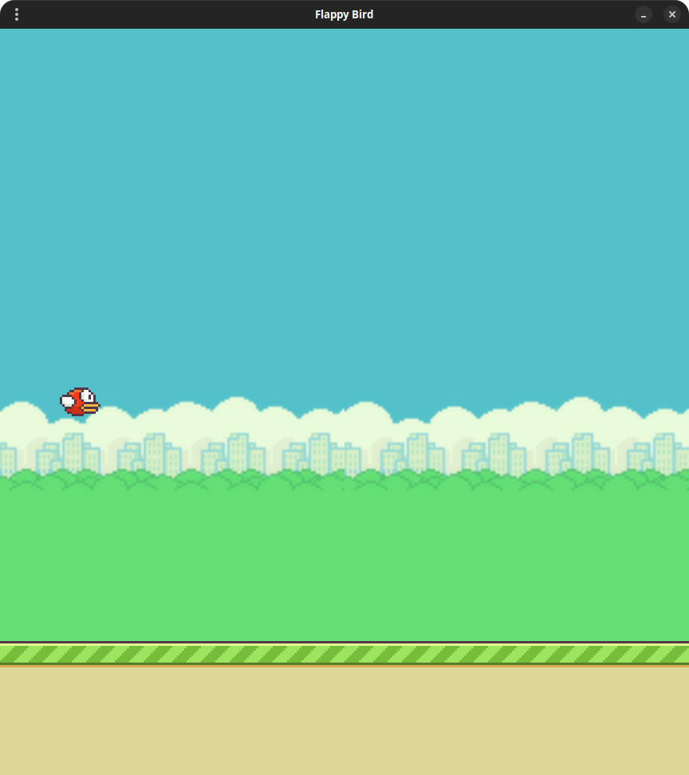

# 🐤 Flappy Bird

<p align="center">
  
  
  
  
  
  
  
</p>

<p align="center">
  <a href="#-technologies">Technologies</a>&nbsp;&nbsp;&nbsp;|&nbsp;&nbsp;&nbsp;
  <a href="#-project">Project</a>&nbsp;&nbsp;&nbsp;|&nbsp;&nbsp;&nbsp;
  <a href="#-layout">Layout</a>&nbsp;&nbsp;&nbsp;|&nbsp;&nbsp;&nbsp;
  <a href="#-license">License</a>
</p>

<p align="center">
  
</p>

<p align="center">
  
</p>

A classic Flappy Bird clone built from scratch using Python and the PyGame library.

## 💻 Technologies

- Python 3.11.2
- PyGame
- Git
- Ruff

## 🚀 Features

- **Classic Gameplay:** Flap your way through randomly generated pipes.
- **Score Tracking:** Keeps track of your current score and high score.
- **Smooth Physics:** Responsive gravity and jump mechanics.
- **Audio Effects:** Retro sound effects for jumping, scoring, and crashing.

## 🛠️ Prerequisites

Before running the game, ensure you have Python installed (version 3.8 or higher recommended).

## 📦 Installation & Setup

```bash
# Clone the Flappy Bird repository from GitHub to your local machine
git clone https://github.com/filipebteixeira98/flappy-bird

# Move into the project's root directory
cd flappy-bird

# Create a virtual environment named '.venv' to isolate project dependencies
python -m venv .venv

# Activate the virtual environment (use '.venv\Scripts\activate' if on Windows)
source .venv/bin/activate

# Install all development and project dependencies listed in the requirements file
pip install -r requirements-dev.txt

# Run the main script to start the Flappy Bird game
python main.py
```

## 🫶 Contributing

Contributions are welcome! Please feel free to submit a Pull Request.

## 📝 License

This project is under the MIT license.

<p align="center">
  Made with ♥ by me
</p>
